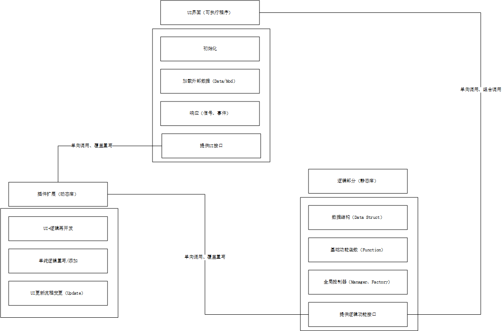

# Qt插件系统的使用

## 插件的简介

插件是用于扩展主程序功能的额外的动态加载的程序，在插件设计中提供接口和具体实现，在主程序中通过加载插件-调用接口以通过插件中封装的方法处理数据，或加载插件中提供的新功能。

在Qt中，QApplication作为主程序框架，对外部提供统一的接口，可提供动态和静态两类接口。

通过一个插件管理器对插件数据进行管理，对插件行为状态进行监测，保存有一个命令树执行管理插件的元指令。在外部，通过独立编写的插件编译成动态库或封装至程序中的静态库，实现为主程序提供“源”，在主程序中加载-注册实现插件安装 。

使用Qt的插件系统进行插件开发，通常需要经历三个阶段：插件程序编写、主程序逻辑添加、link。

在**插件程序中**需要进行以下步骤：

* 将插件程序build为一个library（以动态库为示例）

* 创建一个插件接口文件作为基类，提供插件的功能接口。

    在该基类中，应该对插件的IID进行定义，同时通过宏对这个接口进行声明

    ```c++
    #define PluginInterfaceIID "com.auratest.PluginInterface/1.0.0"
    //定义插件的IID，类似java中的包命名：组织机构域名加产品名加版本号
    class PluginInterface{...};
    
    Q_DECLARE_INTERFACE(PluginInterface,PluginInterfaceIID)
    //通过宏将该接口进行声明
    //
    //
    ```

    **Q_DECLARE_INTERFACE**用于将一个**字符串标识符**与一个**接口类名**关联起来。这个标识符必须是**唯一**的，用于在运行时识别和转换接口类型。这个宏通常用于定义插件的接口，以便Qt的元对象系统能够识别和使用它们。   

    这个宏必须**放在命名空间之外**，如果接口类在命名空间中定义，则需要在宏中使用完整的限定名。 

    在此例中，这个宏的作用是定义了一个名为PluginInterfaceIID的全局变量，存储了接口的**标识符字符串**，以及一个名为qt_metacast_PluginInterface的全局函数，用于将QObject指针转换为PluginInterface指针。这个函数会调用QObject的metaObject()方法，获取对象的元信息，然后比较元信息中的接口列表是否包含PluginInterfaceIID，如果是，则返回对象的指针，否则返回空指针。

* 具体的**子类**实现中，需要多继承QObject和插件基类，同时需要使用三个宏函数进行元对象注册、配置插件的元数据、对插件接口的IID进行校验。

    ```c++
    class PLUGINDEMO1_EXPORT PluginDemo1:public QObject,public PluginInterface
    {
        Q_OBJECT   //元对象注册
        Q_PLUGIN_METADATA(IID PluginInterfaceIID)    //设置当前插件的元数据并对外提供实例
        Q_INTERFACES(PluginInterface)				//进行插件接口的ID校验
    public:
    	...
    }
    ```

    **Q_PLUGIN_METADATA**用于在插件类中**声明**插件的**元数据**，包括插件的**标识符**和一个包含**插件信息**的JSON文件。这个宏可以让Qt的元对象系统识别和加载插件，以及获取插件的相关属性。这个宏必须放在**插件类的声明中**，且只能使用一次。

    * 第一个**参数IID是必须**的，用于指定插件实现的接口的标识符，这个标识符必须是**唯一**的，通常是一个反向域名形式的字符串。这个标识符用于在运行时**检查**插件是否实现了期望的接口。

    * 第二个**参数FILE是可选**的，用于指定一个本地的JSON文件，该文件可以**描述**插件的相关数据**信息**，如名称，版本，作者，描述等。这些**信息可以通过QPluginLoader::metaData()方法获取**。如果不想为插件提供信息，可以省略这个参数或者保证JSON文件为空。

    **Q_INTERFACES**用于对插件的接口的ID进行校验，此宏应与**Q_DECLARE_INTERFACE**进行配套使用。

* 之后，就是具体规划插件实例需要实现的具体功能。通常，插件实例应该是**单例**的。

在**主程序**中应该拥有以下步骤：

* 使用QPluginLoader进行插件的加载和卸载。

    ```c++
    #include <QPluginLoader>
    
    QPluginLoader m_loader;
    
    QDir dir(qApp->applicationDirPath());//获取当前程序的执行文件所在路径
    m_loader.setFileName(dir.filePath("PluginDemo1.dll")); //选择加载的插件，通过传入dll库进行。
       
    if(!m_loadr.load())
    {
        QMessageBox::critical(this,"",m_loader.errorString());
        return;
    }
    PluginInterface* pi= qobject_cast<PluginInterface*>(m_loader.instance());
    //进行强制类型转换，确保是PluginInterface的插件。
        if(pi)
        {
            QWidget* w=pi->genWidget();
            if(w)
            {
                ui->tabWidget->addTab(w,"hello plugin");
            }
        }
    //执行具体逻辑
    ```

在构建好两个程序后，应有以下步骤：

* 将插件接口文件放置在主程序的工程项目下。（放声明以调用）
* 将插件程序build后生成的dll放于主程序的工程项目下。（提供源）

本质上，**Qt的插件机制是基于C++原有的动态库、静态库的加载而建立的**。


## 结合反射机制、信号与槽机制的插件系统开发

这部分主要实践方向为为主程序构建插件系统，实现主程序和插件的通信，在设计尽可能简洁、逻辑齐全的主程序流程下，通过插件调用基础接口实现功能。

QT组件本身具备的接口能实现诸多功能，在项目开发上，可基于QT的组件建立新的基类，以该基类为基础进行反射系统的构建，和主要功能模块的开发。

本项目总共设计三个程序模块：主程序流程、主程序逻辑、插件模块。

主程序流程（前端）：

* 模拟的是通常程序的main函数执行流程，主要采用面向过程的编程思想设计，通过**主程序逻辑**封装好的静态库使用数据结构、基础流程，在该模块中实现的是一个交互的程序。
* 实现UI界面展示、应用流程的执行、用户交互的反应。

主程序逻辑（后端）：

* 负责整个项目中的数据结构设计和逻辑处理，提供处理方案的接口，在开发后被封装为静态库，后续开发改动不大。

* 实现基础逻辑和功能、数据处理与数据结构设计。

插件模块（扩展）：

* 作为动态库实现动态加载/卸载，调用静态库对逻辑进行二次开发或延申，通过反射机制和多态指针获取主程序的对象实例进行交互。

* 实现扩展（添加窗体、添加处理、添加展示、更改处理方式）。

注意事项：

* 静态库中的全局变量和静态变量不可在主程序和扩展程序中进行复用，两者分别调用时，获取到的是不同内存区域的“全局变量”（extern也不行）。而动态库去实现这部分功能并不符合开发理念。

* 开发Library时需要注意Qt的工程build，在工程文件中添加合适的预处理（包括添加Core、添加Widget组件、添加C++17、添加ui文件自动构建）

* 对于对象的析构应该有所把控，QT中存在自动回收机制：对象树可以利用，在主程序中对插件的加载卸载、使用Qt提供的deleteLater和利用信号与槽机制实现析构时机的把控。

* 提供插件系统的最重要一点是对基类的设计，即概括共性进行归类，尽量避免接口文件的横向增多，尽量选择由静态库提供的接口的组合，这也是面向对象的思想的精髓。

  
  
  

## 练习项目讲解

该项目分为三个部分：QtPluginSystemCardDynamic、QtPluginSystemMainAppStatic和QtPluginSystemTest，运用到静态库和动态库的构建与使用、插件模块的加载和插件与主程序之间的通信设计。


  


* QtPluginSystemCardDynamic：

    这部分是动态插件的设计，由Qt QCreadter制作的库文件工厂构建，内包含引入静态库的接口文件、UI接口文件进行逻辑的重写或功能的拓展。

* QtPluginSystemMainAppStatic：
    这部分是静态库的设计，作为项目整体的基础逻辑的实现和基础架构，包括构建UI的基础类、组件及其接口、基本数据处理功能。

* QtPluginSystemTest：

    这部分是UI层的内容，包含展示层的方法和UI构建，以及基本的程序流程，该部分的开发应基于面向过程的设计思想。

    

关于插件与主程序之间的**数据互通**：基础的解决方案是传递指针获取主程序的关联地址，通过该地址定位主程序中的管理器，再通过管理器调用整个程序提供的接口。因为在主程序中采用的是基于自定义的基类开发的Widget类，所以在设计接口上非常灵活，也方便在插件编写时导入调用。

关于**设计理念**：私以为，逻辑部分作为整个项目的基础功能的实现，在需求分析、概要设计阶段就应该确定，且在项目完成后很长一段维护时间内不会有大更改，所以符合静态的概念，应当作为静态库进行封装，而它提供的接口可接入动态库进行二次开发，作为功能拓展和逻辑重写，再在主程序的运行过程中载入和等待响应。


